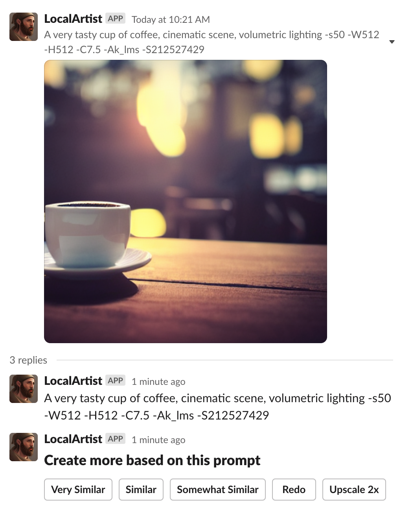

# SlackSD
  Is a very basic slack bot that ties a local Stable Diffusion
  (https://github.com/lstein/stable-diffusion) install to your slack workspace.
  It uses the slack bot socket mode API and can therefore be run without any 
  externally reacable infrastructure.

  If you have a computer with a GPU sitting at home or somewhere where it can not be 
  reached directly from the web, but want its graphics power to work for your Slack 
  Workspace, this bot might just help you out.

## Usage

  Mention the App name in your message to prompt the bot to render an image.

  e.g.
  @LocalArtist A very tasty cup of coffee, cinematic scene, volumetric lighting
  
  

  will render you a tasty drink

  


## Slack Bot creation
  Go to https://api.slack.com/ log in and create a Slack bot.

  Create an ap "from scratch"
  

  Name it, and place it in your workspace
  
 
  Enable socket mode on the app: 
  
  make sure it is turned on, and Event subscriptions are enabled as well:
  
  

  Go to the "OAuth & Permissions" section and add the following scopes:
```
  app_mentions:read
  files:write
  chat:write
  groups:write
  im:write
  mpim:write
  reactions:write
```
  like so:
  

  Now, install the bot to your workspace.

  The bot token and app token will be required when installing the bot in the next section.
  

## Install
  Install the stable diffusion from https://github.com/lstein/stable-diffusion as the bot
  uses its interface to render art.

  I recommend setting up a python environment for the bot.
  
  Then install the slack bot python requirements
```
pip install -r requirements.txt
```

  Setup the environment
```
export SLACKSD_BOT_TOKEN=xoxb-xxxxxxxxx
export SLACKSD_APP_TOKEN=xapp-xxxxxxxxx
export SLACKSD_STABLE_DIFFUSION_PROMPT="~/path/to/the/slacksd/directory/execute_prompt"
export SLACKSD_STABLE_DIFFUSION_PATH="~/path/to/stable-diffusion/"
export SLACKSD_STABLE_DIFFUSION_RESULTS="~/path/to/where/images/are/locally/rendered/to/"
```

  run the bot

```
  python socket_bot.py
```

  

     


